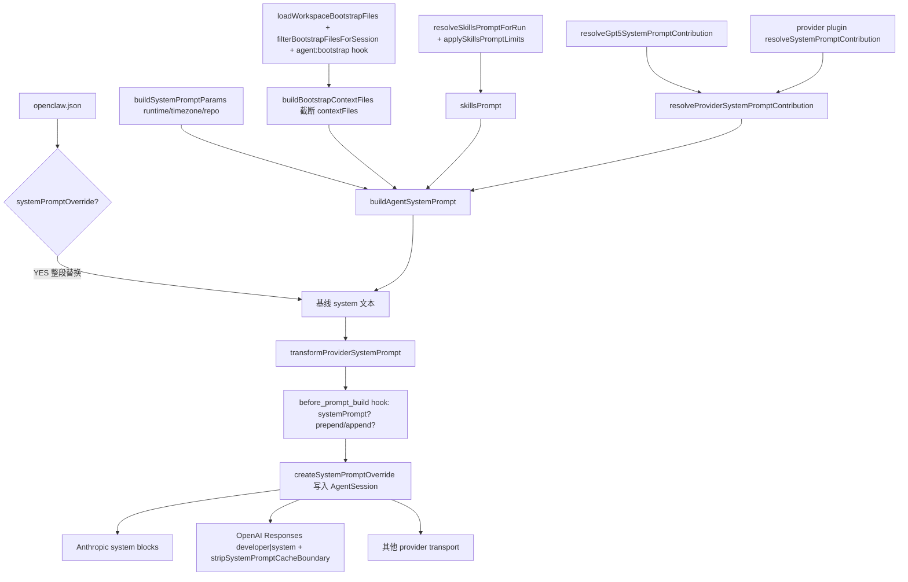

> 本文是 [System prompt](/concepts/system-prompt) 的中文实现侧补充，关注「装配链路」而非用户面文案。所有结论以代码为准；与英文文档不一致处会显式标注。

## 一句话定义

OpenClaw 在每一轮 agent run 之前，由 `buildAgentSystemPrompt` 现场拼出一份「OpenClaw 自有」系统提示词；上层可通过整段覆盖、provider 贡献、插件 hook 三个层级加以改写，再经 transport 层做最后的 cache 边界处理后发送给底层 LLM。

## 总体流程图



## 1. 入口与调用链

- **核心组装函数**：[buildAgentSystemPrompt](src/agents/system-prompt.ts) 位于 `src/agents/system-prompt.ts:425`，返回最终拼接好的 markdown 字符串。
- **嵌入路径薄封装**：[buildEmbeddedSystemPrompt](src/agents/pi-embedded-runner/system-prompt.ts) `:12`，负责把 `tools: AgentTool[]` 折成 `toolNames: string[]` 再调用上面那个函数（见 `:80`）。
- **Compaction 路径**：`src/agents/pi-embedded-runner/compact.ts` 也调用 `buildEmbeddedSystemPrompt` 重建压缩后会话的 system 文本。
- **应用到 session**：拿到字符串后通过 [createSystemPromptOverride](src/agents/pi-embedded-runner/system-prompt.ts) `:92` + [applySystemPromptOverrideToSession](src/agents/pi-embedded-runner/system-prompt.ts) `:99` 直接写入 `session.agent.state.systemPrompt`，并把 `_baseSystemPrompt`/`_rebuildSystemPrompt` 都钉死成同一份字符串，避免 pi-coding-agent 默认提示词逻辑重新生成。

## 2. 三种 prompt 模式

`promptMode` 不是用户配置，而是运行时根据 sessionKey 决定的：

| 模式      | 触发                                                              | 行为                                                                                                                                                                  |
| --------- | ----------------------------------------------------------------- | --------------------------------------------------------------------------------------------------------------------------------------------------------------------- |
| `full`    | 默认主代理                                                        | 包含全部章节                                                                                                                                                          |
| `minimal` | 子代理 / cron 会话（`isSubagentSessionKey` / `isCronSessionKey`） | 省略 Skills、Memory、Self-Update、Model Aliases、User Identity、Reply Tags、Messaging、Silent Replies、Heartbeats；`extraSystemPrompt` 标题改成 `## Subagent Context` |
| `none`    | 极简调用                                                          | 仅返回身份首行 `You are a personal assistant running inside OpenClaw.`（见 [system-prompt.ts](src/agents/system-prompt.ts) `:672`）                                   |

- 决策点：[resolvePromptModeForSession](src/agents/pi-embedded-runner/run/attempt.prompt-helpers.ts) `:92`。

## 3. 各组成部分逐节拆解

下表按 `buildAgentSystemPrompt` 内 `lines.push(...)` 的真实顺序整理：

| 顺序 | 段名                                                             | 来源                                                                                                                          | 备注                                                                                                    |
| ---- | ---------------------------------------------------------------- | ----------------------------------------------------------------------------------------------------------------------------- | ------------------------------------------------------------------------------------------------------- |
| 1    | 身份首行                                                         | 字面量                                                                                                                        | `:677`                                                                                                  |
| 2    | `## Tooling`                                                     | `coreToolSummaries` + `toolOrder` + `params.toolSummaries`                                                                    | `:478`、`:513`、`:570`；明确写「TOOLS.md 不控制工具可用性」(`:702`)                                     |
| 3    | `## Tool Call Style`                                             | provider `sectionOverrides.tool_call_style` 否则内置                                                                          | `:721`                                                                                                  |
| 4    | `## Execution Bias`                                              | provider `sectionOverrides.execution_bias` 否则 [buildExecutionBiasSection](src/agents/system-prompt.ts) `:299`               | `full` 模式下生效                                                                                       |
| 5    | provider `stablePrefix`                                          | [resolveProviderSystemPromptContribution](src/plugins/provider-runtime.ts) `:132`                                             | 与 GPT-5 contribution 合并后插入                                                                        |
| 6    | `## Safety`                                                      | [safetySection](src/agents/system-prompt.ts) `:647`                                                                           | `full` / `minimal` 都保留                                                                               |
| 7    | CLI 自更新（`OpenClaw Self-Update`）                             | 取决于 `gateway` 工具是否可用                                                                                                 | 仅 `full`                                                                                               |
| 8    | `## Skills (mandatory)` + `<available_skills>`                   | [buildSkillsSection](src/agents/system-prompt.ts) `:156` + [resolveSkillsPromptForRun](src/agents/skills/workspace.ts) `:814` | 仅当 `skillsPrompt` 非空                                                                                |
| 9    | Memory 段                                                        | [buildMemorySection](src/agents/system-prompt.ts) `:174` → [buildMemoryPromptSection](src/plugins/memory-state.ts) `:206`     | 由 memory 插件 `promptBuilder` 提供，**不灌库内容**；context-engine 启用时 `includeMemorySection=false` |
| 10   | Workspace / Docs / Sandbox / Authorized Senders                  | [buildDocsSection](src/agents/system-prompt.ts) `:395`、[buildUserIdentitySection](src/agents/system-prompt.ts) `:217`        | docs 仅 `full` 注入                                                                                     |
| 11   | `## Current Date & Time`                                         | [buildTimeSection](src/agents/system-prompt.ts) `:248`                                                                        | **只写 `Time zone:`，不写动态钟面**（cache 友好）                                                       |
| 12   | `## Workspace Files (injected)` 引导句                           | 字面量                                                                                                                        | `:862`，告诉模型下方会出现 Project Context                                                              |
| 13   | Assistant Output Directives / Webchat Canvas / Messaging / Voice | 多个 builder                                                                                                                  | 仅 `full`                                                                                               |
| 14   | `## Reactions`                                                   | `params.reactionGuidance`（如 Telegram）                                                                                      | 通道驱动                                                                                                |
| 15   | `## Reasoning Format`                                            | `reasoningTagHint`                                                                                                            | 需要 `<think>/<final>` 协议时                                                                           |
| 16   | `# Project Context`（**稳定**部分）                              | `params.contextFiles` 中非动态文件，按 [CONTEXT_FILE_ORDER](src/agents/system-prompt.ts) `:44` 排序                           | 含 SOUL 时追加一行 persona 提醒（`:114`）                                                               |
| 17   | `## Silent Replies`                                              | 字面量                                                                                                                        | 仅 `full`                                                                                               |
| 18   | **`SYSTEM_PROMPT_CACHE_BOUNDARY`**                               | [常量](src/agents/system-prompt-cache-boundary.ts) `:3` 值为 `\n<!-- OPENCLAW_CACHE_BOUNDARY -->\n`                           | 上方稳定可复用、下方为易变                                                                              |
| 19   | `# Dynamic Project Context`                                      | `DYNAMIC_CONTEXT_FILE_BASENAMES`（目前只有 `heartbeat.md`）                                                                   | `:54`、`:914`、`:947`                                                                                   |
| 20   | `## Group Chat Context` 或 `## Subagent Context`                 | `params.extraSystemPrompt`                                                                                                    | 标题随 `promptMode` 切换                                                                                |
| 21   | provider `dynamicSuffix`                                         | provider contribution                                                                                                         | 易变 provider 文案                                                                                      |
| 22   | `## Heartbeats`                                                  | [buildHeartbeatSection](src/agents/system-prompt.ts) `:127`                                                                   | 仅 `full` 且有 `heartbeatPrompt`                                                                        |
| 23   | `## Runtime` + `Reasoning:`                                      | [buildRuntimeLine](src/agents/system-prompt.ts) `:976`                                                                        | 永远在末尾                                                                                              |

## 4. Bootstrap 工作区文件注入

### 物理读取

[loadWorkspaceBootstrapFiles](src/agents/workspace.ts) `:477` 按**固定顺序**读以下八个文件，缺失的也会以 `missing: true` 占位（`:538`）：

```
AGENTS.md → SOUL.md → TOOLS.md → IDENTITY.md → USER.md → HEARTBEAT.md → BOOTSTRAP.md → MEMORY.md
```

`MEMORY.md` 仅当 `exactWorkspaceEntryExists` 通过才会读（`:520`），避免误读大文件。

### 子代理 / cron 白名单

[filterBootstrapFilesForSession](src/agents/workspace.ts) `:552` 在 sub-agent / cron 会话上保留五项：

```ts
const MINIMAL_BOOTSTRAP_ALLOWLIST = new Set([
  DEFAULT_AGENTS_FILENAME, // AGENTS.md
  DEFAULT_TOOLS_FILENAME, // TOOLS.md
  DEFAULT_SOUL_FILENAME, // SOUL.md
  DEFAULT_IDENTITY_FILENAME, // IDENTITY.md
  DEFAULT_USER_FILENAME, // USER.md
]);
```

> **注意**：英文 [docs/concepts/system-prompt.md](/concepts/system-prompt) `:134` 描述为 “only inject AGENTS.md and TOOLS.md”，但代码实际白名单含 5 项（包含 SOUL/IDENTITY/USER）。**以代码为准。**

### Hook 拦截

bootstrap 文件可以被 [agent:bootstrap](src/plugins/hooks.ts) hook 在拼接前替换或修改，例如换 SOUL 持人格化。Hook 输出的 `path` 字段必须是 path（不是 filePath），否则 [buildBootstrapContextFiles](src/agents/pi-embedded-helpers/bootstrap.ts) `:288` 会 warn 并跳过。

### 截断与预算

由 [buildBootstrapContextFiles](src/agents/pi-embedded-helpers/bootstrap.ts) `:271` 与 [trimBootstrapContent](src/agents/pi-embedded-helpers/bootstrap.ts) `:132` 共同负责：

- 单文件上限：[resolveBootstrapMaxChars](src/agents/pi-embedded-helpers/bootstrap.ts) `:106`，配置键 `agents.defaults.bootstrapMaxChars`，默认 12000。
- 总量上限：[resolveBootstrapTotalMaxChars](src/agents/pi-embedded-helpers/bootstrap.ts) `:114`，配置键 `agents.defaults.bootstrapTotalMaxChars`，默认 60000。
- 警告策略：[resolveBootstrapPromptTruncationWarningMode](src/agents/pi-embedded-helpers/bootstrap.ts) `:122`，配置键 `agents.defaults.bootstrapPromptTruncationWarning`，默认 `once`。
- 头/尾比例由 `BOOTSTRAP_HEAD_RATIO` / `BOOTSTRAP_TAIL_RATIO` 决定，缺位时塞入 `[...truncated, read <FILE> for full content...]` 标记或紧凑 `[…truncated H+T/N]`。

### 在 prompt 中的位置

`Project Context` 段把所有非动态文件按 [CONTEXT_FILE_ORDER](src/agents/system-prompt.ts) `:44` 排序：`agents.md(10) → soul.md(20) → identity.md(30) → user.md(40) → tools.md(50) → bootstrap.md(60) → memory.md(70) → 其他(MAX)`。任何被列入 `DYNAMIC_CONTEXT_FILE_BASENAMES` 的文件（当前只有 `HEARTBEAT.md`）排在 cache 边界**之后**，独立成 `# Dynamic Project Context` 段。

## 5. Skills 注入

OpenClaw **不**把每个 SKILL.md 全文塞进 system prompt，而是注入一份「目录 + 路径 + 描述」清单，让模型按需 `read`：

- 入口 [resolveSkillsPromptForRun](src/agents/skills/workspace.ts) `:814`：优先读 `skillsSnapshot.prompt`，否则用 `entries` 现场跑 [buildWorkspaceSkillsPrompt](src/agents/skills/workspace.ts)。
- 输出形如 `<available_skills><skill><name>...</name><description>...</description><location>...</location></skill>...</available_skills>`。
- 引导文案在 [buildSkillsSection](src/agents/system-prompt.ts) `:156`：要求模型先扫 `<description>`，命中时用 `read` 工具加载 `<location>` 指向的 `SKILL.md`，最多读一份。
- 预算：`skills.limits.maxSkillsPromptChars`（全局）/ `agents.list[].skillsLimits.maxSkillsPromptChars`（per-agent），超限会切换到紧凑格式或截断（[applySkillsPromptLimits](src/agents/skills/workspace.ts) 附近，`:800`）。
- 与 `agents.defaults.contextLimits.*` 区分：那是 runtime 读取/注入的预算，与技能目录尺寸不混。

## 6. 凭据 / 会话 / 记忆 / 工具 / 时间 / 平台

| 信息                                   | 是否进 system prompt | 真实位置                                                                                                                                       |
| -------------------------------------- | -------------------- | ---------------------------------------------------------------------------------------------------------------------------------------------- |
| API key、provider token、refresh token | **否**               | turn 时单独走 `resolveEmbeddedAgentApiKey`、Anthropic OAuth 等流，不写文本                                                                     |
| Authorized senders（owner numbers）    | 是（仅 `full`）      | [buildOwnerIdentityLine](src/agents/system-prompt.ts) `:232`；可选 `ownerDisplay=hash` 用 HMAC/SHA-256 截前 12 位（`:224`）                    |
| 当前会话的群聊上下文                   | 是                   | `extraSystemPrompt` → `## Group Chat Context`（`:957`）                                                                                        |
| 子代理身份信息                         | 是                   | [buildSubagentSystemPrompt](src/agents/subagent-system-prompt.ts) `:4` 经 `extraSystemPrompt` 注入，标题改为 `## Subagent Context`             |
| 记忆数据库内容                         | **否**               | 仅注入 memory 工具的能力说明与引用规范，由 [buildMemoryPromptSection](src/plugins/memory-state.ts) `:206` 提供；context-engine 接管时整段跳过  |
| 工具能力                               | 是                   | 来自 `params.toolNames`（pi-agent-core 已注册的工具名），用 `coreToolSummaries` 给摘要；TOOLS.md 不参与                                        |
| 当前时间                               | 仅时区               | [buildTimeSection](src/agents/system-prompt.ts) `:248`；`session_status` 工具才会暴露动态时间戳，避免破坏 KV cache                             |
| 主机/OS/node/model/repo/channel        | 是                   | [buildRuntimeLine](src/agents/system-prompt.ts) `:976`，单行 `Runtime: agent=… host=… os=… node=… model=… channel=… capabilities=… thinking=…` |

## 7. 拼接顺序与 Cache Boundary

[SYSTEM_PROMPT_CACHE_BOUNDARY](src/agents/system-prompt-cache-boundary.ts) `:3` 是字面量 `\n<!-- OPENCLAW_CACHE_BOUNDARY -->\n`。它的语义协议：

- **上方**（稳定段）：身份、Tooling、Safety、Skills、Memory 能力说明、Workspace、Docs、Time（仅 timezone）、Project Context（非动态）等。
- **下方**（易变段）：Dynamic Project Context（HEARTBEAT.md）、`extraSystemPrompt`（群聊/子代理）、provider `dynamicSuffix`、Heartbeats 引导、Runtime 一行。

辅助 API：

- [splitSystemPromptCacheBoundary](src/agents/system-prompt-cache-boundary.ts) `:9`：拆成 `{ stablePrefix, dynamicSuffix }`。
- [prependSystemPromptAdditionAfterCacheBoundary](src/agents/system-prompt-cache-boundary.ts) `:22`：在边界**之后、动态段之前**追加一段（用于 hook prepend）。
- [stripSystemPromptCacheBoundary](src/agents/system-prompt-cache-boundary.ts) `:5`：把边界标记替换成普通换行，OpenAI Responses 路径在送出前调用（[openai-transport-stream.ts](src/agents/openai-transport-stream.ts) `:244`）。

## 8. 字符上限与裁剪策略

| 子系统             | 配置键                                                                                   | 默认      | 实现                                                                                |
| ------------------ | ---------------------------------------------------------------------------------------- | --------- | ----------------------------------------------------------------------------------- |
| Bootstrap 单文件   | `agents.defaults.bootstrapMaxChars`                                                      | 12000     | [trimBootstrapContent](src/agents/pi-embedded-helpers/bootstrap.ts) `:132` 头尾保留 |
| Bootstrap 总量     | `agents.defaults.bootstrapTotalMaxChars`                                                 | 60000     | `buildBootstrapContextFiles` `remainingTotalChars` 递减（`:280`）                   |
| Bootstrap 截断告警 | `agents.defaults.bootstrapPromptTruncationWarning`                                       | `once`    | 注入 `## ⚠️ Workspace File Truncation Notice` 块                                    |
| Skills 目录        | `skills.limits.maxSkillsPromptChars` / `agents.list[].skillsLimits.maxSkillsPromptChars` | 见 schema | `applySkillsPromptLimits`，超限可换紧凑格式                                         |
| 运行时读取/注入    | `agents.defaults.contextLimits.*` / `agents.list[].contextLimits.*`                      | 见 schema | 与 system prompt 拼接无关，约束 `memory_get`、tool 输出等                           |

`promptMode` 只控制章节有无，不直接控字符数。

## 9. Provider 适配

### 9.1 provider contribution 合并

[resolveProviderSystemPromptContribution](src/plugins/provider-runtime.ts) `:132` 把两路输入合并：

1. **GPT-5 叠加** [resolveGpt5SystemPromptContribution](src/agents/gpt5-prompt-overlay.ts) `:117`：模型名匹配 `gpt-5(...)` 时返回 `stablePrefix=GPT5_BEHAVIOR_CONTRACT`；当 `agents.defaults.promptOverlays.gpt5.personality === "friendly"` 时附带 `sectionOverrides.interaction_style = GPT5_FRIENDLY_PROMPT_OVERLAY`。
2. **provider 插件** `resolveSystemPromptContribution(context)`：例如 [extensions/openai/prompt-overlay.ts](extensions/openai/prompt-overlay.ts)、[extensions/codex/prompt-overlay.ts](extensions/codex/prompt-overlay.ts) 等。

合并语义见 [mergeProviderSystemPromptContributions](src/plugins/provider-runtime.ts) `:149`：

- `stablePrefix` / `dynamicSuffix` 用 [mergeUniquePromptSections](src/plugins/provider-runtime.ts) `:171` 去重 + `\n\n` 拼接（`base` 在前，`override` 在后）。
- `sectionOverrides` 走对象浅合并，**override 后写胜出**（覆盖同名 section）。

### 9.2 文本级 transform

[transformProviderSystemPrompt](src/plugins/provider-runtime.ts) `:176` 在 base 字符串生成后，对**整串**再调用 plugin 的 `transformSystemPrompt`，并应用 `textTransforms.input` 文本替换链。

### 9.3 transport 选择 system / developer / 直接发文本

| Provider                    | 实现                                                                                              | 行为                                                                                                                                                                                                 |
| --------------------------- | ------------------------------------------------------------------------------------------------- | ---------------------------------------------------------------------------------------------------------------------------------------------------------------------------------------------------- |
| Anthropic Messages          | [anthropic-transport-stream.ts](src/agents/anthropic-transport-stream.ts) `:630`                  | `params.system = [{ type:"text", text: <prompt> }]`；OAuth (Claude Code) 模式会前置一段固定品牌句 `You are Claude Code, Anthropic's official CLI for Claude.` 再追加 OpenClaw prompt                 |
| OpenAI Responses            | [openai-transport-stream.ts](src/agents/openai-transport-stream.ts) `:241`                        | reasoning 模型且 `supportsDeveloperRole !== false` 时 `role:"developer"`，否则 `role:"system"`；并在送出前 [stripSystemPromptCacheBoundary](src/agents/system-prompt-cache-boundary.ts) 去掉边界标记 |
| OpenAI WebSocket / Realtime | [openai-ws-stream.ts](src/agents/openai-ws-stream.ts)                                             | 同样去边界                                                                                                                                                                                           |
| Google / Gemini             | [pi-embedded-runner/google-prompt-cache.ts](src/agents/pi-embedded-runner/google-prompt-cache.ts) | 走自己的 cache 体系，仍以拼好的字符串为输入                                                                                                                                                          |
| ACP / Claude Code 套娃      | [cli-runner/claude-live-session.ts](src/agents/cli-runner/claude-live-session.ts)                 | 把 OpenClaw prompt 注入到外部 CLI 的 system 段                                                                                                                                                       |

### 9.4 cache control

Anthropic 路径的 cache 标记由 [applyAnthropicPayloadPolicyToParams](src/agents/anthropic-payload-policy.ts) 处理；GPT-5 / Codex 等路径由各自 `prompt-overlay.ts` 与 `prompt-cache-retention.ts`/`prompt-cache-observability.ts` 配合。

## 10. 覆盖优先级（从高到低）

1. **配置整段覆盖**：[resolveSystemPromptOverride](src/agents/system-prompt-override.ts) `:12`，命中 `agents.list[].systemPromptOverride` 或 `agents.defaults.systemPromptOverride` 后**完全替换** `buildEmbeddedSystemPrompt` 的产出。
2. **插件 hook 整段替换**：`before_prompt_build` 返回 `systemPrompt` 时，attempt 直接整段替换 session 的 system（[attempt.ts](src/agents/pi-embedded-runner/run/attempt.ts) 约 `:1970`）。
3. **prepend / append context**：hook 返回 `prependSystemContext` / `appendSystemContext` 时由 [composeSystemPromptWithHookContext](src/agents/pi-embedded-runner/run/attempt.thread-helpers.ts) `:8` 与 base 顺序拼接（`prepend → base → append`，并经 `normalizeStructuredPromptSection` 规整空行）。
4. **provider transform**：[transformProviderSystemPrompt](src/plugins/provider-runtime.ts) `:176` 对最终字符串再做一次替换。
5. **provider section override / stable prefix / dynamic suffix**：在 `buildAgentSystemPrompt` 内部生效，受 `sectionOverrides` 命中范围约束（仅 `interaction_style` / `tool_call_style` / `execution_bias` 三个 ID）。
6. **GPT-5 personality 叠加**：仅 GPT-5 模型，且与 provider plugin 合并。

> 所以「先盖再生成」的次序其实是：**生成阶段** GPT-5/插件 contribution 介入 → 字符串成型后 provider transform → hook prepend/append/replace → 最终用 `applySystemPromptOverrideToSession` 钉到 session.systemPromptOverride 完全跳过前面所有步骤（这是「最强」覆盖路径）。

## 11. 子代理 / 群聊 / Compaction 的差异

- **子代理**：spawn 时由 [buildSubagentSystemPrompt](src/agents/subagent-system-prompt.ts) `:4` 生成 `# Subagent Context` 文案（含 `## Your Role` / `## Rules` / `## Output Format` / `## What You DON'T Do`），与 attachments 一起塞进 `extraSystemPrompt`；child 的 `promptMode` 被 [resolvePromptModeForSession](src/agents/pi-embedded-runner/run/attempt.prompt-helpers.ts) `:92` 自动判定为 `minimal`，所以 base prompt 自动去掉 Skills/Memory/Messaging 等段。
- **群聊**：通道层（如 Discord/Telegram）通过 `extraSystemPrompt` 输入群聊上下文，标题为 `## Group Chat Context`（仅 `full`）。
- **Compaction**：[src/agents/pi-embedded-runner/compact.ts](src/agents/pi-embedded-runner/compact.ts) 同样调用 `buildEmbeddedSystemPrompt` 重建 system，配合 [src/agents/harness/prompt-compaction-hook-helpers.ts](src/agents/harness/prompt-compaction-hook-helpers.ts) 让 hook 在压缩前后能更新 prepend/append。

## 12. 关键文件与行号速查表

| 主题                         | 路径                                                                                                                       | 关键行号                                                                                                                                                                                                                                           |
| ---------------------------- | -------------------------------------------------------------------------------------------------------------------------- | -------------------------------------------------------------------------------------------------------------------------------------------------------------------------------------------------------------------------------------------------- |
| 主组装函数                   | [src/agents/system-prompt.ts](src/agents/system-prompt.ts)                                                                 | `425`（入口）/ `513`（toolOrder）/ `513-579`（Tooling）/ `647`（Safety）/ `674`（none 模式 short-circuit）/ `676-973`（lines.push 主体）/ `941-944`（cache boundary 注释）/ `976-1017`（Runtime 行）                                               |
| 章节小工具                   | 同上                                                                                                                       | `127`（Heartbeats）/ `156`（Skills）/ `174`（Memory）/ `217`（Authorized Senders）/ `248`（Time）/ `255`（Output Directives）/ `275`（Webchat Canvas）/ `299`（Execution Bias）/ `316-333`（provider 覆盖工具）/ `335`（Messaging）/ `395`（Docs） |
| 嵌入薄封装                   | [src/agents/pi-embedded-runner/system-prompt.ts](src/agents/pi-embedded-runner/system-prompt.ts)                           | `12`（buildEmbeddedSystemPrompt）/ `92`（createSystemPromptOverride）/ `99`（applySystemPromptOverrideToSession）                                                                                                                                  |
| 整段覆盖                     | [src/agents/system-prompt-override.ts](src/agents/system-prompt-override.ts)                                               | `12`（resolveSystemPromptOverride）                                                                                                                                                                                                                |
| Cache 边界                   | [src/agents/system-prompt-cache-boundary.ts](src/agents/system-prompt-cache-boundary.ts)                                   | `3`（常量）/ `5`（strip）/ `9`（split）/ `22`（prependAfterBoundary）                                                                                                                                                                              |
| Provider 贡献                | [src/agents/system-prompt-contribution.ts](src/agents/system-prompt-contribution.ts)                                       | `1-28` 类型；section ID 仅三个                                                                                                                                                                                                                     |
| Provider 合并/transform      | [src/plugins/provider-runtime.ts](src/plugins/provider-runtime.ts)                                                         | `132`（合并入口）/ `149`（mergeProviderSystemPromptContributions）/ `171`（mergeUniquePromptSections）/ `176`（transformProviderSystemPrompt）                                                                                                     |
| GPT-5 叠加                   | [src/agents/gpt5-prompt-overlay.ts](src/agents/gpt5-prompt-overlay.ts)                                                     | `7`（friendly overlay）/ `50`（behavior contract）/ `100`（resolveGpt5PromptOverlayMode）/ `117`（resolveGpt5SystemPromptContribution）                                                                                                            |
| 工作区文件读盘               | [src/agents/workspace.ts](src/agents/workspace.ts)                                                                         | `477`（loadWorkspaceBootstrapFiles）/ `544`（MINIMAL_BOOTSTRAP_ALLOWLIST）/ `552`（filterBootstrapFilesForSession）                                                                                                                                |
| Bootstrap 注入与截断         | [src/agents/pi-embedded-helpers/bootstrap.ts](src/agents/pi-embedded-helpers/bootstrap.ts)                                 | `106-129`（resolve\* 配置）/ `132`（trimBootstrapContent）/ `271`（buildBootstrapContextFiles）                                                                                                                                                    |
| Skills prompt                | [src/agents/skills/workspace.ts](src/agents/skills/workspace.ts)                                                           | `800` 附近（截断告警）/ `814`（resolveSkillsPromptForRun）                                                                                                                                                                                         |
| Memory 段                    | [src/plugins/memory-state.ts](src/plugins/memory-state.ts)                                                                 | `206`（buildMemoryPromptSection）                                                                                                                                                                                                                  |
| 子代理文案                   | [src/agents/subagent-system-prompt.ts](src/agents/subagent-system-prompt.ts)                                               | `4`（buildSubagentSystemPrompt）                                                                                                                                                                                                                   |
| Hook 拼接                    | [src/agents/pi-embedded-runner/run/attempt.thread-helpers.ts](src/agents/pi-embedded-runner/run/attempt.thread-helpers.ts) | `8`（composeSystemPromptWithHookContext）                                                                                                                                                                                                          |
| Hook 模式判定                | [src/agents/pi-embedded-runner/run/attempt.prompt-helpers.ts](src/agents/pi-embedded-runner/run/attempt.prompt-helpers.ts) | `92`（resolvePromptModeForSession）/ `99`（shouldInjectHeartbeatPrompt）                                                                                                                                                                           |
| Runtime/timezone/repo 解析   | [src/agents/system-prompt-params.ts](src/agents/system-prompt-params.ts)                                                   | `38`（buildSystemPromptParams）                                                                                                                                                                                                                    |
| Anthropic system blocks      | [src/agents/anthropic-transport-stream.ts](src/agents/anthropic-transport-stream.ts)                                       | `630-651`（OAuth vs 普通）                                                                                                                                                                                                                         |
| OpenAI developer/system 选择 | [src/agents/openai-transport-stream.ts](src/agents/openai-transport-stream.ts)                                             | `241-246`                                                                                                                                                                                                                                          |
| 用户面文档                   | [docs/concepts/system-prompt.md](docs/concepts/system-prompt.md)                                                           | 全文                                                                                                                                                                                                                                               |

## 13. 调试与可观测

- `/context list` / `/context detail`：查看每个注入文件的原始/注入大小、是否截断、工具 schema 占比，参见 [docs/concepts/context.md](/concepts/context)。
- `prompt-cache-observability`：[src/agents/pi-embedded-runner/prompt-cache-observability.ts](src/agents/pi-embedded-runner/prompt-cache-observability.ts) + [.test.ts](src/agents/pi-embedded-runner/prompt-cache-observability.test.ts) 在 attempt 中由 `beginPromptCacheObservation` 启用，便于定位 cache miss 源头。
- `pnpm test src/agents/system-prompt*.test.ts`：核心组装的回归用例（`system-prompt.test.ts`、`system-prompt.memory.test.ts`、`system-prompt-stability.test.ts`、`system-prompt-cache-boundary.test.ts`、`system-prompt-override.test.ts`、`system-prompt-report.test.ts` 等）。
- `pnpm test src/agents/prompt-composition.test.ts` + [test/helpers/agents/prompt-composition-scenarios.ts](test/helpers/agents/prompt-composition-scenarios.ts)：跨 promptMode/provider 的合成场景。

## 14. 维护者自查清单

修改 `system-prompt.ts` / 新增章节时请按以下顺序自查：

1. 章节是否需要 `promptMode=minimal` 短路？是否需要在 `none` 模式被绕过？
2. 章节属于「稳定」还是「易变」？决定它在 `SYSTEM_PROMPT_CACHE_BOUNDARY` 的哪一侧。
3. 是否引入新的字符上限？应该走 `bootstrap*` 还是 `skills.limits` 还是新增 `contextLimits.*`？
4. 是否引入新的 provider override 点？应否扩展 `ProviderSystemPromptSectionId` 枚举（同步 `system-prompt-contribution.ts`、provider plugin、测试）？
5. 是否会破坏 prompt cache？避免把动态时间戳、随机 ID、轮次计数写到边界之上。
6. 是否需要同步更新 [docs/concepts/system-prompt.md](/concepts/system-prompt) 与本中文文档的章节列表 / 配置键 / 截断策略？
7. 是否需要更新 `system-prompt.test.ts`、`system-prompt-stability.test.ts`、`prompt-composition.test.ts`？
8. 与 GPT-5 / Codex / Anthropic OAuth 的耦合是否在对应 `extensions/<provider>/prompt-overlay.ts` 与 transport 测试中得到覆盖？

---

> **i18n 提醒**：根据 [docs/CLAUDE.md](docs/CLAUDE.md) 的策略，仓库内一般不维护翻译版文档。本文是**实现侧深度参考**，文件名带 `.zh-CN.md` 后缀，与发布到 Mintlify 的英文 `docs/concepts/system-prompt.md` 共存但不进入 docs i18n 流水线（不属于 `docs/<locale>/**`）。如果未来要正式推出中文版，应迁移到 `openclaw/docs` 发布仓的 i18n 流水线。
